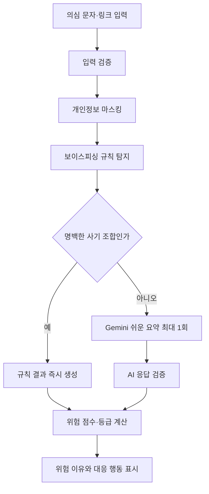

# 보이스피싱 전용 MVP 전환

## 목표

안심글은 의심 문자·메신저·링크를 보이스피싱과 스미싱 관점에서 확인하는 도구다. 고령 사용자가 문자 속 위험 행동을 알아차리고 송금, 앱 설치, 개인정보 제공을 멈추도록 돕는다.

## 현재 분석 흐름

## 활성 분석 모드

| 모드 | 사용 조건 | Gemini 호출 |
| --- | --- | --- |
| `RULE_ONLY` | 명백한 보이스피싱 조합 | 호출하지 않음 |
| `AI_SUMMARY` | 그 외 문자·메신저 | 최대 1회 |

`GROUNDED_FACT_CHECK`, Grounding 파서, citation 타입, `factCheck()` provider 메서드는 과거 기록과 타입 호환을 위해 남아 있다. 새 분석 흐름에서는 선택하거나 호출하지 않는다.

## 즉시 판정 조합

- 가족·지인 사칭과 송금 요구
- 검찰·경찰·금융기관 사칭과 송금 또는 개인정보 요구
- 송금 요구와 긴급성
- 인증번호·비밀번호 요구와 링크
- 원격제어·화면 공유 요구
- 앱 설치와 금융·개인정보 요구
- 협박·처벌 위협과 송금·개인정보 요구
- 다른 사람에게 알리지 말라는 요구와 송금

위 조합은 AI 응답을 기다리지 않는다. 위험 등급과 점수는 규칙 엔진이 계산하며, AI의 문구만으로 `danger`나 `critical`을 만들 수 없다.

## Gemini 역할

Gemini는 다음 정보만 JSON으로 반환한다.

- 쉬운 한국어 한 문장 요약
- 사칭 유형
- 상대가 요구한 행동
- 원문에 실제 있는 의심 구절 최대 3개

뉴스·정책·건강정보의 사실 여부를 검색하거나 판정하지 않는다. Google Search Grounding과 URL Context 도구도 요청에 전달하지 않는다.

## 링크 입력

링크 입력은 페이지 본문을 열지 않는다. 다음 주소 위험 신호만 규칙 기반으로 확인한다.

- `http` 사용
- 직접 IP 주소
- URL 단축 서비스
- 푸니코드
- 주소 안의 사용자명·비밀번호
- 지나치게 긴 호스트명
- 공식 기관을 흉내 낸 도메인
- 일반적이지 않은 포트
- localhost·사설 IP 차단

사용자에게는 링크가 포함된 문자 전체를 함께 붙여넣으면 요구 내용까지 확인할 수 있다고 안내한다.

## 결과 화면

결과는 다음 순서로 표시한다.

1. 위험 단계
2. 이 문자는 무엇을 요구하나요?
3. 왜 조심해야 하나요?
4. 지금 할 일
5. 이미 행동했나요?
6. 결과 소리로 듣기

가족 사칭, 기관·금융 사칭, 원격제어, 투자·수익 보장, 인증정보 탈취에 맞는 행동 안내를 제공한다. Amazon Polly 결과 읽기 기능은 이 순서의 핵심 내용을 그대로 읽으며, AWS 키·환경변수·실제 합성 검증은 별도 운영 절차로 관리한다.

## 검증 불변식

- 문자 분석 한 건당 Gemini 호출은 최대 1회
- 명백한 사기 조합은 Gemini 호출 0회
- URL 입력은 Gemini 호출 0회
- `summarize`와 `factCheck`를 함께 호출하지 않음
- AI 신호 점수는 최대 10점이며 단독으로 위험·고위험을 만들지 않음
- 개인정보는 분석과 기록 전 마스킹
- Polly는 같은 결과를 다시 들을 때 Blob을 재사용

## 제외 범위

이번 전환에서는 AWS 키 설정, AWS 권한 설정, 실제 Polly 합성, 브라우저 음성 폴백, 음성 선택, SSML, 음성 저장을 변경하지 않는다.
